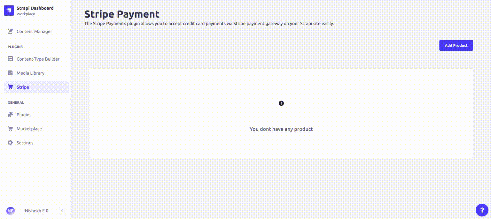

# Strapi-stripe

[Stripe](https://stripe.com/) Online payment processing for internet businesses. It's a suite of payment APIs that powers commerce for online businesses of all sizes.

[Strapi](https://strapi.io/) is the leading open-source headless CMS. It’s 100% JavaScript, fully customizable and developer-first.

## Stripe Payment

The Stripe Payments plugin allows you to accept credit card payments via Stripe payment gateway on your Strapi site easily.

Your customers will be redirected to the “Checkout Result” page after the credit card payment. This page shows them the details of the transaction (the item that they just paid for).

The transaction info is also captured in the Report section of the plugin. You can view all the payments you received from your Strapi admin dashboard.

The setup is very easy. Once you have installed the plugin, all you need to do is enter your Stripe API credentials in the plugin settings and your website will be ready to accept credit card payments.

You can run it in test mode by specifying test API keys in the plugin settings.

It has a simple embed code that lets you put Stripe “Buy Now” buttons anywhere on your site for any products that you sell online.

<!-- <a href="https://www.npmjs.com/package/bigbluebutton-strapi">

</a>
<a href="https://www.npmjs.org/package/bigbluebutton-strapi">

</a> -->

<br/><br/>

## ✨ Features

- Quick installation and setup.
- Easily take payment for a product that you sell on your site.
- Create buy buttons for your products or services on the fly and embed it anywhere on your site using a user-friendly embed code.
- Ability to add multiple “Buy Now” buttons to a page.
- View transaction details for all your products from your Strapi admin dashboard.
- Ability to specify a custom name, photo and description for a product.
- Ability to configure a notification email to be sent to the buyer and seller after the purchase.
- Ability to customize the message on the Checkout Result page.
- Ability to configure the currency type for the payment.

<br/><br/>

 <br/>

<br/><br/>

## ⚙️ Versions

- **Strapi v4**

<br/><br/>

## 🖐 Requirements

The requireemnts to install the Strapi-Stripe plugin is same as those to install Strapi.

Please refer to the official Strapi installation requirement doc here: [Installation Requirements](https://docs.strapi.io/developer-docs/latest/getting-started/introduction.html).

**Minimum environment requirements**

- Node.js `>=14.x.x`
- NPM `>=6.x.x`

We are following the [official Node.js releases timelines](https://nodejs.org/en/about/releases/).

**Supported Strapi versions**:

- Strapi v4.1.5 (recently tested)
- Strapi v4.x

> The BigBlueButton-Strapi plugin is designed for **Strapi v4.x**. It won't work with Strapi v3.x.

<br/><br/>

## ⏳ Installation

Use **npm** to install this plugin within your Strapi project (recommended).

[Refer to this doc to install npm](https://docs.npmjs.com/cli/v6/commands/npm-install)

```bash
npm i strapi-stripe
```

After successful installation you would need to build a fresh package that includes the BigBlueButton-Strapi plugin UI. Please execute the commands below:

```bash
# with npm (option 1)
$ npm run build
$ npm run develop

# with npx (option 2)
$ npx strapi  build
$ npx strapi  develop
```

The **Stripe** plugin should appear in the **Plugins** section of Strapi sidebar after you run app again.

Now you are ready to launch your Stripe Payment 🎉

<br/><br/>

## 🔧 Configuration

You can easily configure the Strapi-Stripe plugin to connect with your Stripe Account.

- Go to `Strapi Settings -> STRIPE -> Configuration`.
- On the configiration page, Enter All the fields.
- You can toggle between Stripe test mode and Stripe Live mode. Using Live Mode CheckBox.
- Click on save to save the Stripe Confiiguration.

<br/><br/>

<br/><br/>

<br/>

## Create Product

Once successfully Configured stripe in strapi settting, now you can create products in stripe.

- click on Stripe in the **Plugins** section.click on Add Product.
- Enter Title,Price,Image Url,Description. Click on Save, it will create product both in strapi and stripe.

<br/><br/>

<br/><br/>

<br/>

## Embed code

Once Product creates, click on Embed Code,It gives all the necessary Code to embed On Your Front-End Application.

- Embed Script tag to Your Produuct page,Payment Success page,Payment failure page.
- Embed Payment Button Code in your Product page.

<br/>

## Stripe Payment

Once you Embed code to your front-end application, its ready to accept the payments from Stripe.
<br/><br/>

<br/><br/>

<br/>

## Stripe Payment Report

Strapi-Stripe Plugin also Provides Payment Transaction history. for future Reference

- click on Report Icon in the action column.
  <br/><br/>
  
  <br/><br/>

<br/>

## 📝 License

[MIT License](LICENSE.md)

Copyright (c) [HigherEdLab.com](https://higheredlab.com/).
